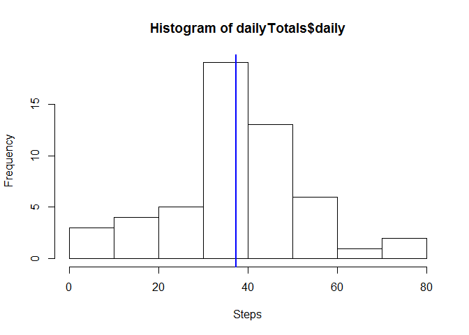

# Reproducible Research: Peer Assessment 1


## Loading and preprocessing the data
The data is already located in the right location. First, let's load it into a data frame, and run `str` and `summary` on the data frame to get an idea of what's in it:

```r
allDF <- read.csv("activity.csv", header = TRUE)
str(allDF)
```

```
## 'data.frame':	17568 obs. of  3 variables:
##  $ steps   : int  NA NA NA NA NA NA NA NA NA NA ...
##  $ date    : Factor w/ 61 levels "2012-10-01","2012-10-02",..: 1 1 1 1 1 1 1 1 1 1 ...
##  $ interval: int  0 5 10 15 20 25 30 35 40 45 ...
```

```r
summary(allDF)
```

```
##      steps                date          interval     
##  Min.   :  0.00   2012-10-01:  288   Min.   :   0.0  
##  1st Qu.:  0.00   2012-10-02:  288   1st Qu.: 588.8  
##  Median :  0.00   2012-10-03:  288   Median :1177.5  
##  Mean   : 37.38   2012-10-04:  288   Mean   :1177.5  
##  3rd Qu.: 12.00   2012-10-05:  288   3rd Qu.:1766.2  
##  Max.   :806.00   2012-10-06:  288   Max.   :2355.0  
##  NA's   :2304     (Other)   :15840
```

```r
head(allDF)
```

```
##   steps       date interval
## 1    NA 2012-10-01        0
## 2    NA 2012-10-01        5
## 3    NA 2012-10-01       10
## 4    NA 2012-10-01       15
## 5    NA 2012-10-01       20
## 6    NA 2012-10-01       25
```

```r
# in case we need to modify the date field:
# myData$Date <- as.Date(myData$Date, format = "%d/%m/%Y")
```
For the next section we are interested in daily totals, so let's summarise these and we'll take a look at the result by running `head`:

```r
library("dplyr")
```

```r
dailyTotals <- allDF %>%
  group_by(date) %>%
  summarise(daily = sum(steps))

head(dailyTotals)
```

```
## Source: local data frame [6 x 2]
## 
##         date daily
## 1 2012-10-01    NA
## 2 2012-10-02   126
## 3 2012-10-03 11352
## 4 2012-10-04 12116
## 5 2012-10-05 13294
## 6 2012-10-06 15420
```
## What is mean total number of steps taken per day?

```r
summary(dailyTotals$daily)
```

```
##    Min. 1st Qu.  Median    Mean 3rd Qu.    Max.    NA's 
##      41    8841   10760   10770   13290   21190       8
```

```r
hist(dailyTotals$daily, xlab = "Steps", breaks = 5)
meanDaily <- mean(dailyTotals$daily, na.rm = TRUE)
meanDaily
```

```
## [1] 10766.19
```

```r
abline(v = meanDaily, col = "blue", lwd = 2)
```

 

## What is the average daily activity pattern?

```r
with(allDF, {
        plot(interval, steps, type = "l")
} )
```

 

```r
#             #xlab = "", ylab = "Global Active Power (kilowatts)"
```


## Imputing missing values


## Are there differences in activity patterns between weekdays and weekends?
