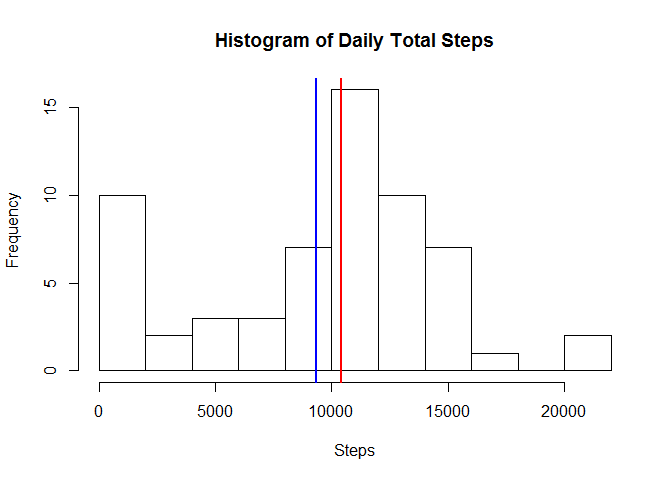
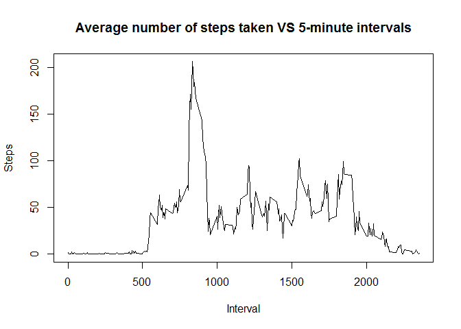
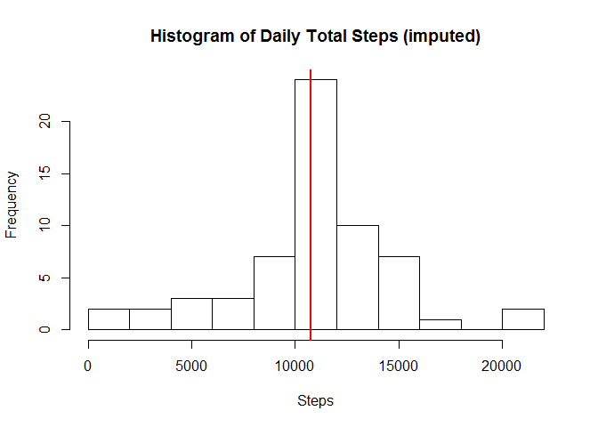
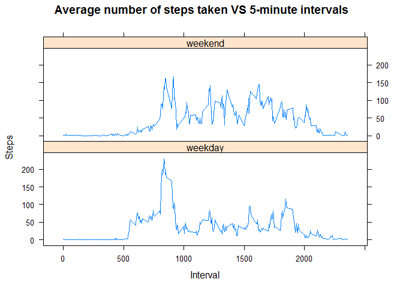

# Reproducible Research: Peer Assessment 1


## Loading and preprocessing the data
The data is already located in the right location. So, let's load it into a data frame (activityDF), and run `str`, `summary` and `head` on the data frame to get a sense of what's in it:

```r
activityDF <- read.csv("activity.csv", header = TRUE)
str(activityDF)
```

```
## 'data.frame':	17568 obs. of  3 variables:
##  $ steps   : int  NA NA NA NA NA NA NA NA NA NA ...
##  $ date    : Factor w/ 61 levels "2012-10-01","2012-10-02",..: 1 1 1 1 1 1 1 1 1 1 ...
##  $ interval: int  0 5 10 15 20 25 30 35 40 45 ...
```

```r
summary(activityDF)
```

```
##      steps                date          interval     
##  Min.   :  0.00   2012-10-01:  288   Min.   :   0.0  
##  1st Qu.:  0.00   2012-10-02:  288   1st Qu.: 588.8  
##  Median :  0.00   2012-10-03:  288   Median :1177.5  
##  Mean   : 37.38   2012-10-04:  288   Mean   :1177.5  
##  3rd Qu.: 12.00   2012-10-05:  288   3rd Qu.:1766.2  
##  Max.   :806.00   2012-10-06:  288   Max.   :2355.0  
##  NA's   :2304     (Other)   :15840
```

```r
head(activityDF)
```

```
##   steps       date interval
## 1    NA 2012-10-01        0
## 2    NA 2012-10-01        5
## 3    NA 2012-10-01       10
## 4    NA 2012-10-01       15
## 5    NA 2012-10-01       20
## 6    NA 2012-10-01       25
```
We can see that the date field is a factor class, so let's modify it to be a date class:

```r
# modify the date field from factor to date:
activityDF$date <- as.Date(activityDF$date, format = "%Y-%m-%d")
```
We're now ready to continue.

## What is mean total number of steps taken per day?
To answer this question we are interested in taking the average (i.e., mean) of the daily total steps, so let's:

1. group the Activity Dataframe by the date,
2. calculate a daily total (sum), and
3. look at the result by running `head` on the result.

First, load the dplyr package (Note: messages and warnings off for this code section only):

```r
library("dplyr")
```

```r
dailyTotals <- activityDF %>%
        group_by(date) %>%
        summarise(dailyTotal = sum(steps, na.rm = TRUE))
head(dailyTotals, n = 10)
```

```
## Source: local data frame [10 x 2]
## 
##          date dailyTotal
## 1  2012-10-01          0
## 2  2012-10-02        126
## 3  2012-10-03      11352
## 4  2012-10-04      12116
## 5  2012-10-05      13294
## 6  2012-10-06      15420
## 7  2012-10-07      11015
## 8  2012-10-08          0
## 9  2012-10-09      12811
## 10 2012-10-10       9900
```

Now let's plot a histogram of the total number of steps taken each day:

```r
with(dailyTotals, {
        hist(dailyTotal,
             xlab = "Steps",
             main = "Histogram of Daily Total Steps",
             breaks = 10
        )
        abline(v = mean(dailyTotal), col = "blue", lwd = 2)
        abline(v = median(dailyTotal), col = "red", lwd = 2)
} )
```

 

The *mean* and *median* values for the number of steps taken each day can be determined using `summary`:

```r
summary(dailyTotals$dailyTotal)
```

```
##    Min. 1st Qu.  Median    Mean 3rd Qu.    Max. 
##       0    6778   10400    9354   12810   21190
```

Otherwise, the *mean* and *median* values can be shown (without rounding) by running `mean` and `median` directly:

1. mean: 9354.2295082
2. median: 10395

## What is the average daily activity pattern?
To answer this question we are interested in averaging each interval across all days, so let's:

1. group the Activity Dataframe by the intervals,
2. calculate the average (mean) for each interval, and
3. look at the result by running `summary` on the result.


```r
with(intervalDF <- activityDF %>%
        group_by(interval) %>%
        summarise(average = mean(steps, na.rm = TRUE)), {
                plot(x = interval,
                     y = average,
                     type = "l",
                     xlab = "Interval",
                     ylab = "Steps",
                     main = "Average number of steps taken VS 5-minute intervals"
                )
                summary(average)
        }
)
```

 

```
##    Min. 1st Qu.  Median    Mean 3rd Qu.    Max. 
##   0.000   2.486  34.110  37.380  52.830 206.200
```

The interval where the maximum number of steps across the 5-minute intervals occurs is 835:


```r
filter(intervalDF, average == max(average))
```

```
## Source: local data frame [1 x 2]
## 
##   interval  average
## 1      835 206.1698
```

## Imputing missing values
There are a number of days/intervals in the dataset where there are missing values (coded as NA).

The number of NA's in the Activity Dataframe is:

```r
sum(is.na(activityDF$steps))
```

```
## [1] 2304
```

The presence of missing days may introduce bias into some calculations or summaries of the data. To address this, a strategy for filling in all of the missing values in the dataset is taken for each 5-minute interval (that has an NA for 'steps') by replacing it with the corresponding average 5-minute value using intervalDF calculated previously. 


```r
imputedDF <- activityDF
for(i in seq(from = 0, to = 2355, by = 5)) {
        # for each 'steps' value (interval i) where the value is NA, 
        # replace it with the corresponding average value for that interval
        imputedDF$steps[imputedDF$interval == i & is.na(imputedDF$steps)] <-
                intervalDF$average[intervalDF$interval == i]
}
```

Now we can make a histogram of the total number of steps taken each day and calculate and report the *mean* and *median* total number of steps taken per day, using `summary`:


```r
with(imputedDailyTotals <- imputedDF %>%
       group_by(date) %>%
       summarise(dailyTotal = sum(steps)), {
               hist(dailyTotal,
                    xlab = "Steps",
                    main = "Histogram of Daily Total Steps (imputed)",
                    breaks = 10)
               abline(v = mean(dailyTotal), col = "blue", lwd = 2)
               abline(v = median(dailyTotal), col = "red", lwd = 2)
               summary(dailyTotal)
       }
)
```

 

```
##    Min. 1st Qu.  Median    Mean 3rd Qu.    Max. 
##      41    9819   10770   10770   12810   21190
```

Otherwise, the *mean* and *median* values can be shown (without rounding) by running `mean` and `median` directly:

1. mean: 1.0766189\times 10^{4}
2. median: 1.0766189\times 10^{4}

These values differ from the estimates from the first part of the assignment, which were:

1. mean: 9354.2295082
2. median: 10395

The impact of imputing missing data on the estimates of the total daily number of steps using this strategy is that, on one hand, the bias towards high frequency of low numbered data (steps) is reduced, the variance of the data is reduced (evidenced by the median equalling the mean). This is consistent with the observation by Pigott (2001) that "replacing missing values with a single value changes the distribution of that variable by decreasing the variance that is likely present."

Pigott, T. D. (2001). A review of methods for missing data. *Educational research and evaluation*, 7(4), 353-383.

## Are there differences in activity patterns between weekdays and weekends?

Using the Imputed Dataframe (imputedDF), for this part the weekdays() function is used to create a new factor variable (daytype) in the dataset with two levels - "weekday" and "weekend", indicating whether a given date is a weekday or weekend day.

A lattice panel plot is drawn containing a time series plot (i.e. type = "l") of the 5-minute interval (x-axis) and the average number of steps taken, averaged across all weekday days or weekend days (y-axis).


```r
weekdaysDF <- imputedDF %>%
        mutate(daytype = ifelse(weekdays(date) %in% c("Saturday","Sunday"), "weekend", "weekday")) %>%
        mutate(daytype = as.factor(daytype))

library(lattice)
with(weekdaysDF <- imputedDF %>%
        mutate(daytype = ifelse(weekdays(date) 
                %in% c("Saturday","Sunday"), "weekend", "weekday")) %>%
        mutate(daytype = as.factor(daytype)) %>%
        group_by(daytype, interval) %>%
        summarise(average = mean(steps)), {
                xyplot(average ~ interval | daytype,
                       type = "l",
                       main="Average number of steps taken VS 5-minute intervals",
                       xlab="Interval",
                       ylab="Steps", 
                       layout=c(1,2))
        }
)
```

 
